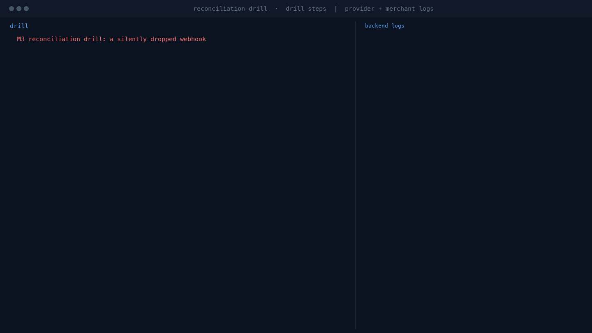

# pqa-payments-sandbox

Local payment integration environment that emulates multiple payment providers. It is meant for developing and verifying merchant-side payment integrations before switching to real sandbox accounts.

Each emulator implements provider-style endpoints, state transitions and webhook delivery with provider-style signatures. The demo merchant shows a reference integration: provider adapters, signature verification, idempotent webhook handling and order state.

Do not use this project with real payment data.

## Modules

| Module | Port | Role |
| --- | --- | --- |
| `stripe-emulator` | 8101 | Stripe-style PaymentIntents and signed webhooks (`Stripe-Signature`) |
| `paypal-emulator` | 8102 | PayPal Orders v2 create/capture and transmission-signed webhooks |
| `card-acquirer-emulator` | 8103 | Card authorize, capture, refund, void, 3DS challenge, test-card rules |
| `crypto-emulator` | 8104 | Deposit address, simulated deposits, confirmations, deposit callback |
| `demo-merchant` | 8200 | Reference merchant: adapters, signature verification, idempotent webhooks |

## Build and run

Requirements: JDK 17, Maven 3.8 or newer.

```bash
mvn -B test        # build and run unit tests
./scripts/demo.sh  # local end-to-end demo
```

`demo.sh` builds the project, starts all emulators and the demo merchant, registers webhook endpoints, runs one payment flow per provider until the order is `PAID`, prints each order, then stops the services.

## Payment flows

### Stripe

1. The merchant creates an order (`POST /orders` with `provider=stripe`).
2. The merchant calls the emulator `POST /v1/payment_intents` with `confirm=true`.
3. The emulator moves the intent to `succeeded` and delivers `payment_intent.succeeded` to registered webhook endpoints, signed as `Stripe-Signature: t=...,v1=<hmac>`.
4. The merchant verifies the signature, deduplicates by event id and marks the order `PAID`.

### PayPal

1. The merchant creates an order (`provider=paypal`) and receives a `CREATED` order id.
2. `POST /orders/{id}/approve` calls the emulator `POST /v2/checkout/orders/{id}/capture`.
3. The emulator delivers `PAYMENT.CAPTURE.COMPLETED` with PayPal transmission headers (`paypal-transmission-id`, `paypal-transmission-time`, `paypal-transmission-sig`, `paypal-webhook-id`).
4. The merchant verifies the transmission signature and marks the order `PAID`.

### Card

1. The merchant creates an order with `provider=card`. Card details are sent to `POST /v1/charges` as an authorization request.
2. Test cards produce one of three results: authorized, declined with a reason, or `REQUIRES_ACTION` for the 3DS card.
3. For a 3DS charge the merchant calls `POST /orders/{id}/challenge`, then `POST /orders/{id}/approve` to capture the authorized charge.
4. The emulator delivers `payment.captured` with an `X-Pqa-Signature` header. The merchant verifies it and marks the order `PAID`.

Test cards (number, result):

| Card number | Result |
| --- | --- |
| `4242424242424242` | authorized |
| `4000000000000002` | declined, `insufficient_funds` |
| `4000000000009995` | declined, `expired_card` |
| `4000000000000069` | declined, `processing_error` |
| `4000000000000027` | 3DS challenge required |

`cvc` value `000` declines with `incorrect_cvc`. Past expiry dates decline with `expired_card`.

### Crypto

1. The merchant creates an order with `provider=crypto` and receives a deposit address.
2. A deposit is simulated at `POST /v1/deposits` on the crypto emulator.
3. `POST /v1/deposits/{id}/confirmations` advances confirmations. At 3 confirmations the deposit moves to `CONFIRMED` and the emulator delivers `deposit.confirmed` once, with `X-Pqa-Signature` and the transaction hash.
4. The merchant verifies the signature and marks the order `PAID`.

## Emulator notes

- Request and response bodies are JSON in all emulators. The real Stripe API accepts form-encoded requests, so the body format is a deliberate simplification; endpoint paths, field names and headers follow provider conventions.
- Default webhook secrets are fixed for local use: `whsec_pqa_stripe_test`, `whsec_pqa_paypal_test`, `whsec_pqa_card_test` and `whsec_pqa_crypto_test`. Override them through environment variables when needed.
- The Stripe emulator supports failure injection through `POST /v1/scenarios` with `drop`, `duplicate`, `bad_signature` or `delay_ms` for a given payment intent and event type.
- Crypto confirmations are driven manually through the confirmations endpoint. A deposit can cross the threshold only once.

## Adding another provider

A new provider is an independent module under `emulators/` plus one adapter in `demo-merchant`. The steps are the same for each provider:

1. Create a module that implements the provider's API style: endpoint paths, request and response fields, and its webhook signature format.
2. Implement webhook registration and delivery, including retry and failure-injection behavior.
3. Add an adapter in `demo-merchant` that maps an order to that provider and back.
4. Add a flow to `demo.sh` or module tests that ends with the order in `PAID`.
5. Document provider-specific differences in the emulator notes section.

Existing emulators do not depend on each other, so one provider can be added or changed without touching the others.

## M3: reconciliation drill (silently dropped webhook)



A provider can confirm a payment while its webhook never arrives: the money moved, the order did not. The drill reproduces that on purpose:

1. The merchant creates a Stripe order and the emulator drops `payment_intent.succeeded` for it.
2. The provider intent is `succeeded` while the merchant order stays `PENDING` with no `paidSource`.
3. The sandbox clock advances five minutes, so the scheduled reconciliation window is visible in seconds instead of minutes.
4. The reconciliation task pulls the payment intent from the provider, sees `succeeded`, and recovers the order: `status=PAID`, `paidSource=reconciliation`.

Run it:

```bash
./scripts/reconciliation-drill.sh
```

The script prints a six-step timeline and, after every step, the provider and merchant log lines produced by that step:

1. build and start: service startup logs
2. customer starts a payment: payment intent created, order created
3. provider confirms, webhook dropped: intent confirmed, DROP scenario active, merchant waiting for a webhook
4. order stuck: check line shows zero webhook deliveries while the provider says `succeeded`
5. five minutes later: sandbox clock advanced
6. reconciliation recovers the order: recovered order and scan summary

The output is written to `target/reconciliation-drill/drill.log`. The rendered recording is in [docs/reconciliation-drill.gif](docs/reconciliation-drill.gif): drill steps on the left, backend logs on the right, and a dashed separator with a short pause at the start of each step. A still frame is in [docs/reconciliation-drill.png](docs/reconciliation-drill.png), and an asciinema recording in [docs/reconciliation-drill.cast](docs/reconciliation-drill.cast).

Design notes:

- Reconciliation is pull-based and idempotent. A second scan does not touch a recovered order; tests cover the double-recovery case.
- Provider status is the source of truth: `succeeded` (Stripe), `COMPLETED` (PayPal), `CAPTURED` (card).
- Crypto deposits are skipped by the reconciliation lookup because the merchant stores the deposit address, not a queryable deposit id. That gap is deliberate and a good exercise for a later milestone.

Drill endpoints used by the script (not part of a real integration):

| Endpoint | Purpose |
| --- | --- |
| `POST /orders/{id}/confirm-payment` | confirm a Stripe intent created with `confirm=false` |
| `POST /dev/clock/advance` | advance the sandbox clock so a five minute window passes in seconds |
| `GET /reconciliation/report` | scans, pending orders checked, orders recovered |
| `POST /reconciliation/run` | run a scan immediately instead of waiting for the schedule |

## Roadmap

- M3: reconciliation drill — done. See `scripts/reconciliation-drill.sh` and `docs/reconciliation-drill.gif`
- M4: containerized deployment with Dockerfiles, a parity matrix against real sandbox behavior, and a CI smoke test for the full demo

## License

MIT. See [LICENSE](LICENSE).
